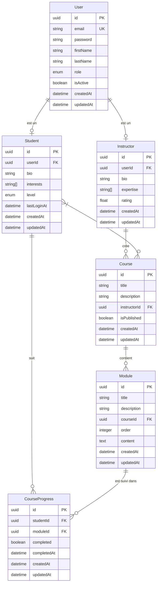

# Diagramme des Relations entre Entités

## Légende

### Types de Relations

- `||--o|` : Relation One-to-One (1:1)
- `||--o{` : Relation One-to-Many (1:N)
- `}|--o{` : Relation Many-to-Many (N:M)

### Cardinalités

- `|o` : Zéro ou Un
- `||` : Exactement Un
- `}o` : Zéro ou Plusieurs
- `}{` : Un ou Plusieurs

### Types de Données

- `PK` : Primary Key (Clé Primaire)
- `FK` : Foreign Key (Clé Étrangère)
- `UK` : Unique Key (Clé Unique)

## Description des Relations

1. **User - Student/Instructor**
   - Un User peut être soit un Student, soit un Instructor (héritage)
   - La relation est gérée via une clé étrangère userId dans Student et Instructor

2. **Instructor - Course**
   - Un Instructor peut créer plusieurs Courses
   - Un Course appartient à un seul Instructor

3. **Course - Module**
   - Un Course contient plusieurs Modules
   - Un Module appartient à un seul Course
   - Les Modules sont ordonnés via le champ order

4. **Student - Course**
   - Un Student peut s'inscrire à plusieurs Courses
   - Un Course peut avoir plusieurs Students inscrits
   - Relation Many-to-Many gérée via une table de jointure

5. **Student - CourseProgress**
   - Un Student peut avoir plusieurs CourseProgress
   - Un CourseProgress appartient à un seul Student

6. **Module - CourseProgress**
   - Un Module peut avoir plusieurs CourseProgress
   - Un CourseProgress est lié à un seul Module

## Notes Importantes

1. **Héritage User**
   - L'héritage est implémenté via une relation One-to-One entre User et Student/Instructor
   - Chaque Student/Instructor a son propre User associé

2. **Progression des Cours**
   - La progression est suivie au niveau du Module via CourseProgress
   - Le champ completed indique si le Module est terminé
   - Le champ completedAt enregistre la date de complétion

3. **Ordonnancement des Modules**
   - Les Modules d'un Course sont ordonnés via le champ order
   - Cela permet de définir une séquence d'apprentissage 